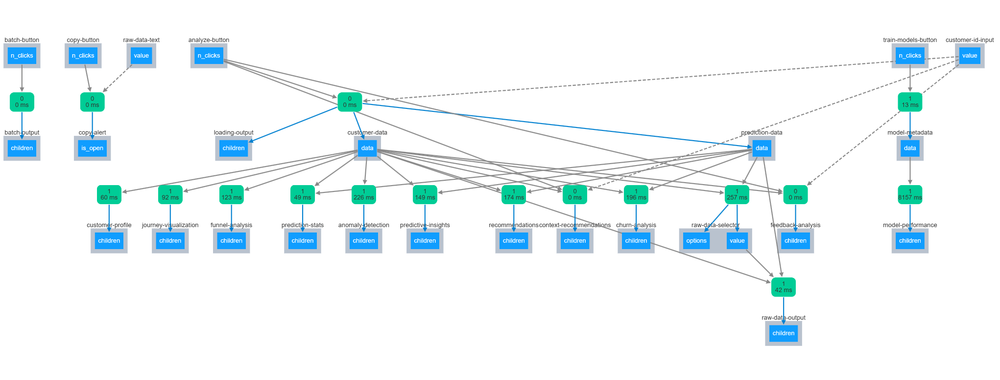

# Marketing Analytics Platform


A comprehensive marketing analytics platform leveraging **graph database technology**, **machine learning**, and **natural language processing** to deliver deep insights into customer journeys, personalized recommendations, and predictive analytics.

Built with:
- **Python**
- **Neo4j**
- **Dash**

---

## 🌟 Features

- **Customer Journey Visualization**: Interactive dashboards for analyzing customer interactions and behavior.
- **Enhanced Personalization**: Context-aware recommendations factoring in time, location, weather, and events.
- **Natural Language Processing**: Sentiment analysis and topic modeling for customer feedback.
- **Predictive Analytics**: Churn prediction, lifetime value forecasting, and next purchase prediction.
- **Reinforcement Learning**: Self-optimizing recommendation system that learns from customer interactions.
- **Anomaly Detection**: Identifies unusual customer behavior patterns.
- **Neo4j Graph Database**: Powerful relationship-based data modeling and querying.

---

## 📋 Table of Contents

- [Architecture](#️-architecture)
- [Key Components](#-key-components)
- [Code Examples](#-code-examples)
- [Configuration](#️-configuration)
- [Data Model](#-data-model)

---

## 🏗️ Architecture



The platform follows a modular architecture with four main layers:

- **Data Layer**: Neo4j graph database storing customer data, interactions, and insights.
- **Analytics Layer**: Python modules for data processing, NLP, and machine learning.
- **Visualization Layer**: Dash applications for interactive dashboards.
- **Integration Layer**: Connectors to external services (OpenAI, weather data, etc.).

---

## 🧩 Key Components

### Customer Journey Visualizer
Visualizes customer journeys with interactive timelines, funnel analysis, and conversion metrics.

### Enhanced Personalization Engine
Delivers context-aware recommendations based on customer behavior, preferences, and environmental factors.

### Predictive Models
Forecasts customer behavior including churn probability, lifetime value, and next purchase timing.

### NLP Insights Generator
Analyzes customer feedback using sentiment analysis and topic modeling to extract actionable insights.

---

## 💻 Code Examples

### Customer Journey Visualization
```python
# From demo_journey_visualization.py
@app.callback(
    Output("journey-visualization", "children"),
    [Input("customer-data", "data")]
)
def update_journey_visualization(data):
    """Update journey visualization tab with customer journey data."""
    if not data:
        return html.P("No customer selected", className="text-muted")
    
    journey = data.get("journey", {})
    timeline = journey.get("timeline", [])
    
    if not timeline:
        return html.P("No journey data available for this customer", className="text-muted")
    
    # Create journey timeline visualization
    df = pd.DataFrame(timeline)
    if df.empty:
        return html.P("No journey events to display", className="text-muted")
    
    df['timestamp'] = pd.to_datetime(df['timestamp'])
    df = df.sort_values('timestamp')
    
    fig = go.Figure()
    
    event_colors = {
        'VIEWS': '#3498db',
        'CLICKS_ON': '#2ecc71',
        'VISITS': '#9b59b6',
        'ADDS_TO_CART': '#e74c3c',
        'PURCHASES': '#f1c40f',
        'COMMENTS_ON': '#1abc9c',
        'REFERS': '#34495e'
    }
    
    for event_type in df['event_type'].unique():
        event_df = df[df['event_type'] == event_type]
        fig.add_trace(go.Scatter(
            x=event_df['timestamp'],
            y=[event_type] * len(event_df),
            mode='markers+text',
            marker=dict(size=12, color=event_colors.get(event_type, '#95a5a6'), symbol='circle'),
            text=event_df['description'],
            hoverinfo='text',
            hovertext=[f"Action: {row['description']}<br>Time: {row['timestamp']}<br>Target: {row['target_type']} ({row['target_id']})" 
                       for _, row in event_df.iterrows()],
            name=event_type
        ))
    
    fig.update_layout(
        title="Customer Journey Timeline",
        xaxis_title="Time",
        yaxis_title="Interaction Type",
        height=500,
        hovermode='closest',
        legend=dict(orientation="h", yanchor="bottom", y=1.02, xanchor="right", x=1)
    )
    
    journey_sections = [
        dcc.Graph(figure=fig),
        html.H5("Journey Events", className="mt-4"),
        generate_journey_table(timeline)
    ]
    
    return html.Div(journey_sections)
```

### Context-Aware Recommendations
```python
# From enhanced_personalization.py
def _generate_recommendations(self, customer_data, products, context=None):
    """
    Core recommendation engine combining:
    1. Product affinity (based on purchase history)
    2. Context relevance (time, location, weather, events)
    3. NLP insights (sentiment, preferences)
    4. Reinforcement learning feedback (if available)
    """
    customer_id = customer_data.get("customer_id")
    purchases = customer_data.get("purchases", [])
    viewed_products = customer_data.get("viewed_products", [])
    segments = customer_data.get("segments", [])
    sentiment = customer_data.get("sentiment")
    keywords = customer_data.get("keywords", [])
    
    product_map = {p["id"]: p for p in products}
    product_scores = {}
    
    purchased_categories = [p.get("category") for p in purchases if p.get("category")]
    category_counts = pd.Series(purchased_categories).value_counts()
    total_purchases = sum(category_counts)
    category_preferences = {}
    
    if total_purchases > 0:
        for category, count in category_counts.items():
            category_preferences[category] = count / total_purchases
    
    purchased_ids = [p.get("id") for p in purchases]
    viewed_ids = [p.get("id") for p in viewed_products]
    
    for product in products:
        product_id = product.get("id")
        if product_id in purchased_ids:
            continue
        score = 0.0
        category = product.get("category")
        if category in category_preferences:
            score += category_preferences[category] * 10
        if product_id in viewed_ids:
            score += 5
        product_scores[product_id] = score
    
    if context:
        time_context = context.get("time_context", {})
        weather_context = context.get("weather_context", {})
        event_context = context.get("event_context", {})
        
        time_of_day = time_context.get("time_of_day")
        if time_of_day:
            time_relevant_categories = {
                "morning": ["breakfast", "coffee", "news", "vitamins"],
                "afternoon": ["lunch", "productivity", "snacks", "hydration"],
                "evening": ["dinner", "entertainment", "relaxation", "home"],
                "night": ["sleep", "relaxation", "books", "self-care"]
            }.get(time_of_day, [])
            for product_id, product in product_map.items():
                category = product.get("category", "").lower()
                attributes = product.get("attributes", {})
                if isinstance(attributes, str):
                    try:
                        attributes = json.loads(attributes)
                    except:
                        attributes = {}
                for relevant_category in time_relevant_categories:
                    if relevant_category in category or any(relevant_category in str(attr).lower() for attr in attributes.values()):
                        product_scores[product_id] = product_scores.get(product_id, 0) + 3
        
        if weather_context:
            conditions = weather_context.get("conditions", "").lower()
            is_precipitation = weather_context.get("is_precipitation", False)
            temperature = weather_context.get("temperature", {}).get("fahrenheit", 70)
            weather_relevant_items = []
            if is_precipitation:
                weather_relevant_items.extend(["umbrella", "raincoat", "boots"])
            if "snow" in conditions:
                weather_relevant_items.extend(["snowboots", "winter_coat", "gloves", "heater"])
            if temperature > 80:
                weather_relevant_items.extend(["sunscreen", "hat", "fan", "cooling", "water"])
            elif temperature < 40:
                weather_relevant_items.extend(["jacket", "warm_clothing", "heater", "hot_drinks"])
            for product_id, product in product_map.items():
                category = product.get("category", "").lower()
                name = product.get("name", "").lower()
                attributes = product.get("attributes", {})
                for item in weather_relevant_items:
                    if (item in category or item in name or any(item in str(attr).lower() for attr in attributes.values())):
                        product_scores[product_id] = product_scores.get(product_id, 0) + 4
    
    customer_rewards = self.recommendation_rewards.get(customer_id, {})
    for product_id, reward in customer_rewards.items():
        if product_id in product_scores:
            product_scores[product_id] += reward * 2
    
    if np.random.random() < self.exploration_rate:
        for product_id in np.random.choice(list(product_scores.keys()), size=min(5, len(product_scores)), replace=False):
            product_scores[product_id] += np.random.uniform(2, 5)
    
    sorted_products = sorted([(product_id, score) for product_id, score in product_scores.items()], key=lambda x: x[1], reverse=True)
    
    recommendations = []
    for product_id, score in sorted_products[:10]:
        product = product_map.get(product_id, {})
        explanation = self._generate_recommendation_explanation(product, score, customer_data, context)
        recommendations.append({
            "product_id": product_id,
            "name": product.get("name", ""),
            "category": product.get("category", ""),
            "price": product.get("price", 0),
            "score": score,
            "explanation": explanation,
            "context_aware": context is not None
        })
    
    return recommendations
```

### NLP Analysis for Customer Feedback
```python
# From enhanced_personalization.py
def _process_feedback_with_nlp(self, feedback_data):
    """Process customer feedback with NLP techniques."""
    customer_feedback = defaultdict(list)
    all_feedback_texts = []
    
    for entry in feedback_data:
        customer_id = entry.get("customer_id")
        feedback_text = entry.get("feedback_text", "")
        if feedback_text and len(feedback_text.strip()) > 5:
            customer_feedback[customer_id].append(entry)
            all_feedback_texts.append(feedback_text)
    
    sentiments = []
    for text in all_feedback_texts:
        try:
            result = self.sentiment_analyzer(text)
            sentiments.append(result[0])
        except Exception as e:
            logging.warning(f"Error in sentiment analysis: {e}")
            sentiments.append({"label": "NEUTRAL", "score": 0.5})
    
    if len(all_feedback_texts) >= 5:
        try:
            tfidf_matrix = self.nlp_models["vectorizer"].fit_transform(all_feedback_texts)
            lda_topics = self.nlp_models["lda"].fit_transform(tfidf_matrix)
            feature_names = self.nlp_models["vectorizer"].get_feature_names_out()
            topics = []
            for topic_idx, topic in enumerate(self.nlp_models["lda"].components_):
                top_words_idx = topic.argsort()[:-11:-1]
                top_words = [feature_names[i] for i in top_words_idx]
                topics.append({
                    "id": f"topic_{topic_idx}",
                    "top_words": top_words,
                    "weight": float(np.mean(lda_topics[:, topic_idx]))
                })
        except Exception as e:
            logging.warning(f"Error in topic modeling: {e}")
            topics = []
    else:
        topics = []
    
    customer_insights = {}
    for idx, (customer_id, entries) in enumerate(customer_feedback.items()):
        customer_sentiments = [
            sentiments[all_feedback_texts.index(entry["feedback_text"])]
            for entry in entries if entry.get("feedback_text") in all_feedback_texts
        ]
        if not customer_sentiments:
            continue
        avg_sentiment_score = np.mean([s["score"] for s in customer_sentiments])
        predominant_sentiment = max(set(s["label"] for s in customer_sentiments), key=[s["label"] for s in customer_sentiments].count)
        feedback_texts = [entry["feedback_text"] for entry in entries]
        combined_text = " ".join(feedback_texts)
        words = re.findall(r'\b[a-zA-Z]{3,}\b', combined_text.lower())
        word_freq = pd.Series(words).value_counts()
        common_words = word_freq[word_freq > 1].index.tolist()[:10]
        customer_topics = []
        if topics and len(all_feedback_texts) >= 5:
            customer_indices = [all_feedback_texts.index(text) for text in feedback_texts if text in all_feedback_texts]
            for topic in topics:
                if customer_indices:
                    topic_relevance = np.mean(lda_topics[customer_indices, int(topic["id"].split("_")[1])])
                    if topic_relevance > 0.1:
                        customer_topics.append({
                            "id": topic["id"],
                            "top_words": topic["top_words"],
                            "relevance": float(topic_relevance)
                        })
        customer_insights[customer_id] = {
            "customer_id": customer_id,
            "sentiment": {
                "predominant": predominant_sentiment,
                "score": float(avg_sentiment_score),
                "positive_count": sum(1 for s in customer_sentiments if s["label"] == "POSITIVE"),
                "negative_count": sum(1 for s in customer_sentiments if s["label"] == "NEGATIVE")
            },
            "topics": customer_topics,
            "keywords": common_words,
            "feedback_count": len(entries),
            "latest_feedback": entries[0].get("timestamp", ""),
            "sources": list(set(entry.get("source", "") for entry in entries)),
            "average_rating": np.mean([entry.get("rating", 0) for entry in entries if entry.get("rating") is not None])
        }
    
    global_insights = {
        "topics": topics,
        "total_feedback_count": len(all_feedback_texts),
        "average_sentiment_score": float(np.mean([s["score"] for s in sentiments])),
        "positive_feedback_percentage": sum(1 for s in sentiments if s["label"] == "POSITIVE") / len(sentiments) * 100 if sentiments else 0,
        "analyzed_at": datetime.now().isoformat()
    }
    
    return {"customer_insights": customer_insights, "global_insights": global_insights}
```

### Churn Risk Analysis
```python
# From enhanced_dashboard.py
@app.callback(
    Output("churn-analysis", "children"),
    [Input("customer-data", "data"), Input("prediction-data", "data")]
)
def update_churn_analysis(customer_data, prediction_data):
    """Update churn analysis tab with customer churn risk data."""
    if not customer_data:
        return html.P("No customer selected", className="text-muted")
    
    insights = customer_data.get("insights", {})
    churn_risk = insights.get("churn_risk", {})
    predicted_churn_probability = prediction_data.get("churn_probability", None) if prediction_data else None
    predicted_churn_level = prediction_data.get("churn_risk_level", None) if prediction_data else None
    
    if not churn_risk and predicted_churn_probability is None:
        return html.P("No churn risk data available for this customer", className="text-muted")
    
    overall_risk = churn_risk.get("overall_risk", predicted_churn_level or "Unknown")
    factors = churn_risk.get("factors", {})
    
    risk_color = {"High": "danger", "Medium": "warning", "Low": "success", "Very Low": "info", "Unknown": "secondary"}.get(overall_risk, "secondary")
    
    if predicted_churn_probability is not None:
        gauge_fig = go.Figure(go.Indicator(
            mode="gauge+number+delta",
            value=predicted_churn_probability * 100,
            number={"suffix": "%", "font": {"size": 24}},
            title={"text": "Churn Probability (ML Model)", "font": {"size": 20}},
            delta={"reference": 30, "increasing": {"color": "red"}, "decreasing": {"color": "green"}},
            gauge={
                "axis": {"range": [0, 100], "tickwidth": 1},
                "bar": {"color": "darkblue"},
                "bgcolor": "white",
                "borderwidth": 2,
                "bordercolor": "gray",
                "steps": [{"range": [0, 30], "color": "green"}, {"range": [30, 70], "color": "yellow"}, {"range": [70, 100], "color": "red"}],
                "threshold": {"line": {"color": "red", "width": 4}, "thickness": 0.75, "value": predicted_churn_probability * 100}
            }
        ))
        gauge_fig.update_layout(height=300, margin=dict(l=20, r=20, t=100, b=20))
        risk_indicator = dbc.Card(dbc.CardBody([dcc.Graph(figure=gauge_fig)]), className="mb-4")
    else:
        risk_indicator = dbc.Card(
            dbc.CardBody([
                html.H5("Overall Churn Risk"),
                dbc.Progress(value={"High": 75, "Medium": 50, "Low": 25, "Very Low": 10, "Unknown": 0}.get(overall_risk, 0), color=risk_color, className="mb-3"),
                html.H3(overall_risk, className=f"text-center text-{risk_color}")
            ]),
            className="mb-4"
        )
    
    factor_cards = []
    for factor_name, factor_data in factors.items():
        level = factor_data.get("level", "Unknown")
        factor_color = {"High": "danger", "Medium": "warning", "Low": "success", "Very Low": "info", "Unknown": "secondary"}.get(level, "secondary")
        details = []
        if factor_name == "inactivity":
            days = factor_data.get("days_inactive", 0)
            details.append(html.P(f"Days inactive: {days}"))
        elif factor_name == "purchase_history":
            count = factor_data.get("purchase_count", 0)
            details.append(html.P(f"Purchases: {count}"))
        elif factor_name == "cart_abandonment":
            has_abandoned = factor_data.get("has_abandoned", False)
            details.append(html.P(f"Has abandoned cart: {'Yes' if has_abandoned else 'No'}"))
        elif factor_name == "engagement":
            interactions = factor_data.get("email_interactions", 0)
            details.append(html.P(f"Email interactions: {interactions}"))
        factor_cards.append(
            dbc.Col(
                dbc.Card(
                    dbc.CardBody([
                        html.H5(factor_name.title(), className="card-title"),
                        html.Div([html.H4(level, className=f"text-{factor_color}"), *details])
                    ]),
                    className="h-100"
                ),
                width=6,
                className="mb-3"
            )
        )
    
    recommendations = []
    high_risk_factors = [name for name, data in factors.items() if data.get("level") == "High"]
    if "inactivity" in high_risk_factors:
        recommendations.append(html.Li("Send a re-engagement email with special offer"))
    if "purchase_history" in high_risk_factors:
        recommendations.append(html.Li("Offer a first-purchase discount"))
    if "cart_abandonment" in factors and factors["cart_abandonment"].get("has_abandoned"):
        recommendations.append(html.Li("Send cart recovery email with limited-time discount"))
    if "engagement" in high_risk_factors:
        recommendations.append(html.Li("Improve email subject lines and content relevance"))
    if predicted_churn_probability is not None:
        if predicted_churn_probability > 0.7:
            recommendations.append(html.Li("Immediate retention offer with significant discount"))
        elif predicted_churn_probability > 0.3:
            recommendations.append(html.Li("Proactive outreach with personalized content"))
    
    recommendations_card = dbc.Card(
        dbc.CardBody([
            html.H5("Recommendations to Reduce Churn Risk"),
            html.Ul(recommendations if recommendations else html.Li("No specific recommendations"))
        ]),
        className="mt-3"
    )
    
    churn_sections = [risk_indicator]
    if factor_cards:
        churn_sections.extend([html.H5("Risk Factors"), dbc.Row(factor_cards)])
    if predicted_churn_probability is not None:
        churn_sections.append(
            dbc.Alert(
                [
                    html.H5("Machine Learning Prediction", className="alert-heading"),
                    html.P("This churn probability is calculated using a machine learning model trained on historical customer behavior patterns."),
                    html.P("The model analyzes factors such as activity levels, purchase frequency, engagement metrics, and previous churn patterns to estimate the likelihood of customer churn."),
                ],
                color="info",
                className="mt-3 mb-3"
            )
        )
    churn_sections.append(recommendations_card)
    
    return html.Div(churn_sections)
```

### Reinforcement Learning for Recommendations
```python
# From enhanced_personalization.py
def record_customer_feedback(self, customer_id, product_id, action, score=None):
    """Record customer feedback on recommendations for reinforcement learning."""
    try:
        action_rewards = {
            "view": 0.2, "click": 0.5, "cart": 0.8, "purchase": 1.0, "ignore": -0.1, "dismiss": -0.3
        }
        reward = action_rewards.get(action, 0)
        if score is not None:
            normalized_score = max(0, min(1, (score - 1) / 4))
            reward = (reward + normalized_score) / 2
        
        feedback_query = """
        MATCH (c:Customer {customer_id: $customer_id})
        MATCH (p:Product {id: $product_id})
        MERGE (c)-[f:FEEDBACK_ON]->(p)
        SET f.timestamp = datetime(), f.action = $action, f.score = $score, f.reward = $reward
        RETURN f
        """
        self.run_query(feedback_query, {"customer_id": customer_id, "product_id": product_id, "action": action, "score": score, "reward": reward})
        self._update_recommendation_model(customer_id, product_id, reward)
        logging.info(f"Recorded feedback for customer {customer_id} on product {product_id}: {action}")
        return True
    except Exception as e:
        logging.error(f"Error recording customer feedback: {e}")
        return False

def _update_recommendation_model(self, customer_id, product_id, reward):
    """Update the reinforcement learning model with new feedback."""
    if customer_id not in self.recommendation_rewards:
        self.recommendation_rewards[customer_id] = {}
    current_value = self.recommendation_rewards[customer_id].get(product_id, 0)
    new_value = current_value + self.learning_rate * (reward - current_value)
    self.recommendation_rewards[customer_id][product_id] = new_value
    self._update_related_products(customer_id, product_id, reward)
    self._save_reinforcement_model()
```

---

## ⚙️ Configuration

The platform uses environment variables for configuration, which can be set in a `.env` file:

```
NEO4J_URI=bolt://localhost:7687
NEO4J_USERNAME=neo4j
NEO4J_PASSWORD=your_password
NEO4J_DATABASE=marketing
OPENAI_API_KEY=your_openai_api_key
```

---

## 📊 Data Model

The platform uses a graph data model in Neo4j with the following key entities:


### Nodes
- **Customer**: End users of the system
- **Product**: Items that can be purchased
- **Page**: Website pages that can be visited
- **Segment**: Customer segments for targeting
- **Persona**: Customer personas for personalization
- **FunnelStage**: Stages in the customer journey
- **NLPInsight**: Insights from NLP analysis
- **Context**: Contextual data for recommendations
- **PredictiveModel**: Machine learning model results

### Relationships
- **VIEWS**: Customer views a product or page
- **CLICKS_ON**: Customer clicks on a product, ad, or element
- **VISITS**: Customer visits a page
- **ADDS_TO_CART**: Customer adds a product to cart
- **PURCHASES**: Customer purchases a product
- **COMMENTS_ON**: Customer provides feedback on a product
- **BELONGS_TO**: Customer belongs to a segment
- **HAS_PERSONA**: Customer has a persona
- **USES**: Customer uses a device or browser
- **LIVES_IN**: Customer lives in a location
- **CURRENTLY_AT**: Customer is at a funnel stage
- **COMPLETED**: Customer completed a funnel stage
- **HAS_INSIGHT**: Customer has NLP insights
- **HAS_CONTEXT**: Customer has contextual data
- **HAS_PREDICTION**: Customer has predictive insights
- **RECOMMENDED**: Product recommended to customer
- **SIMILAR_TO**: Customer is similar to another customer

---

## 📈 Dashboard Screenshots


### Customer Journey Timeline
*Customer Journey Timeline visualization showing interactions over time*

### Churn Risk Analysis
*Churn Risk Analysis with predictive indicators and risk factors*

### Context-Aware Recommendations
*Personalized recommendations based on time, weather, and customer context*

### Feedback Analysis
*NLP-powered sentiment analysis and topic modeling of customer feedback*

---

## 🧠 Machine Learning Models

### Churn Prediction Model
Predicts the probability of customer churn based on behavioral patterns, engagement metrics, and purchase history.

```python
# From predictive_models.py (simplified example)
def train_churn_model(self, features, labels):
    """Train a churn prediction model."""
    X_train, X_test, y_train, y_test = train_test_split(features, labels, test_size=0.2, random_state=42)
    pipeline = Pipeline([
        ('scaler', StandardScaler()),
        ('classifier', RandomForestClassifier(n_estimators=100, max_depth=10, random_state=42))
    ])
    pipeline.fit(X_train, y_train)
    y_pred = pipeline.predict(X_test)
    y_prob = pipeline.predict_proba(X_test)[:, 1]
    accuracy = accuracy_score(y_test, y_pred)
    precision = precision_score(y_test, y_pred)
    recall = recall_score(y_test, y_pred)
    f1 = f1_score(y_test, y_pred)
    auc = roc_auc_score(y_test, y_prob)
    feature_importances = dict(zip(self.feature_names, pipeline.named_steps['classifier'].feature_importances_))
    return {
        'model': pipeline,
        'metrics': {'accuracy': accuracy, 'precision': precision, 'recall': recall, 'f1_score': f1, 'auc': auc},
        'feature_importances': feature_importances
    }
```

- **Lifetime Value Prediction**: Forecasts the expected future value of a customer based on purchase patterns and engagement.
- **Next Purchase Prediction**: Predicts when a customer is likely to make their next purchase and what products they might be interested in.
- **Sentiment Analysis**: Analyzes customer feedback to determine sentiment polarity and extract key topics and themes.

---

## 🔄 Data Flow

1. **Data Collection**: Customer interactions are captured and stored in Neo4j.
2. **Data Processing**: Raw data is processed and enriched with contextual information.
3. **Analysis**: Machine learning models and NLP techniques extract insights.
4. **Visualization**: Dashboards present insights in an interactive format.
5. **Recommendation**: Personalized recommendations are generated based on insights.
6. **Feedback Loop**: Customer responses to recommendations improve future recommendations.

---

## 🛠️ Advanced Features

### Context-Aware System
The platform considers various contextual factors when generating recommendations:

```python
# From enhanced_personalization.py
def get_context_data(self, customer_id):
    """Gather contextual data for a customer including time, location, weather, and events."""
    try:
        query = """
        MATCH (c:Customer {customer_id: $customer_id})
        OPTIONAL MATCH (c)-[:LIVES_IN]->(l:Location)
        RETURN c.customer_id as customer_id, c.timezone as timezone, l.city as city,
               l.state as state, l.country as country, l.postal_code as postal_code,
               l.latitude as latitude, l.longitude as longitude
        """
        result = self.run_query(query, {"customer_id": customer_id})
        if not result:
            logging.warning(f"No customer data found for ID: {customer_id}")
            return None
        customer_data = result[0]
        context = {
            "customer_id": customer_id,
            "timestamp": datetime.now().isoformat(),
            "time_context": self._get_time_context(customer_data.get("timezone")),
            "location_context": None,
            "weather_context": None,
            "event_context": None
        }
        if customer_data.get("city") or customer_data.get("postal_code"):
            context["location_context"] = self._get_location_context(customer_data)
            if context["location_context"]:
                context["weather_context"] = self._get_weather_context(context["location_context"])
                context["event_context"] = self._get_event_context(context["location_context"])
        self._store_context_data(customer_id, context)
        logging.info(f"Retrieved context data for customer {customer_id}")
        return context
    except Exception as e:
        logging.error(f"Error getting context data: {e}")
        return None
```

### Reinforcement Learning
Improves recommendations based on customer feedback:

```python
def decay_exploration_rate(self, min_rate=0.05, decay_factor=0.95):
    """Decay the exploration rate over time as the model learns."""
    self.exploration_rate = max(min_rate, self.exploration_rate * decay_factor)
    return self.exploration_rate
```

### Anomaly Detection
Identifies unusual customer behavior patterns:

```python
# From enhanced_dashboard.py (simplified)
def update_anomaly_detection(customer_data):
    """Update anomaly detection tab with customer anomalies."""
    anomaly_query = """
    MATCH (c:Customer {customer_id: $customer_id})-[:HAS_ANOMALY]->(a:Anomaly)
    RETURN a.detected_at as detected_at, a.activity_count as activity_count,
           a.purchase_amount as purchase_amount, a.activity_z_score as activity_z_score,
           a.purchase_z_score as purchase_z_score, a.anomaly_types as anomaly_types
    """
    # Process anomalies...
```

---

## 🙏 Acknowledgements

- **Neo4j** for the graph database
- **Dash** for interactive visualization
- **Hugging Face** for transformers library
- **Scikit-learn** for machine learning tools
- **Plotly** for interactive charts
- **OpenAI** for advanced NLP capabilities


